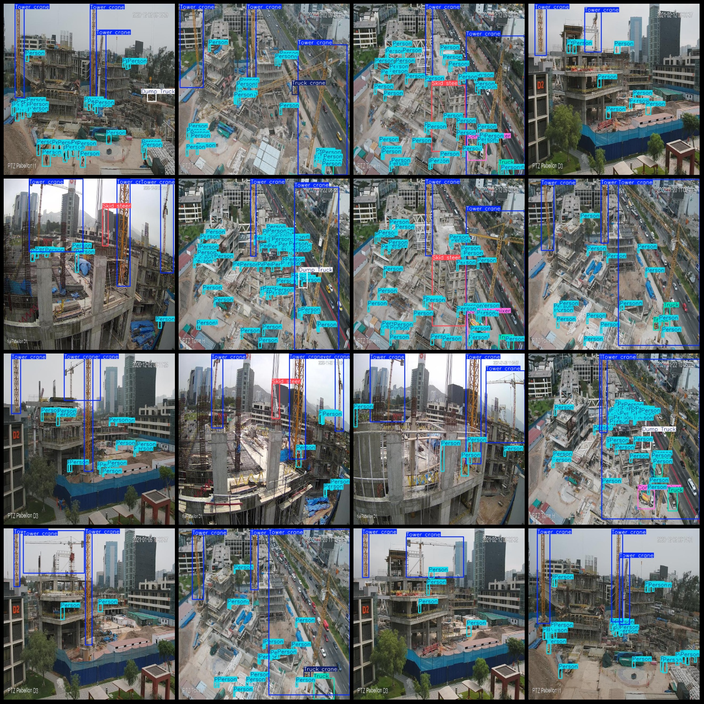
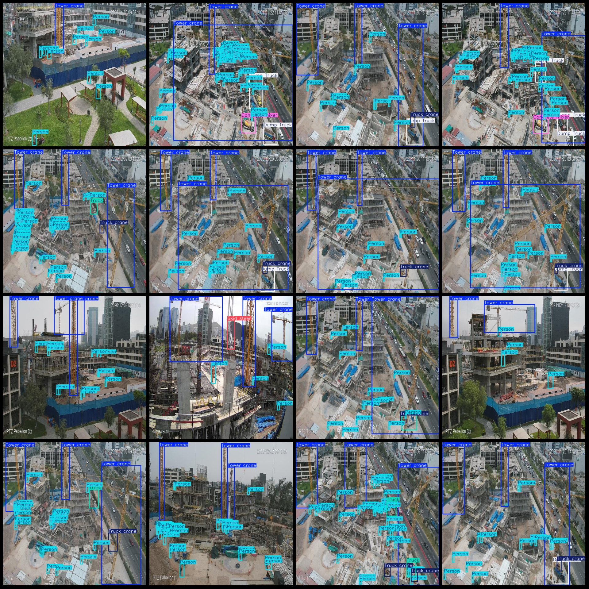

# Drone-Viewpoint Aerial Photography Dataset of Construction Sites with Various Engineering Vehicles and Detection in VOC+YOLO format

## Datasetformat: 
Pascal VOC format+YOLO format (without split path in txtfile, only contain jpgimage and corresponding VOC format xmlfile and yolo format txtfile)

## Number of Images: 1044

## Number of annotations (number of xml files): 1044

1044

### 8. Category Count: 8

## Label names (Note that the order of yolo categories does not match this, but is based on the labels folder's classes.txt): "Concrete mixer", "Dump Truck", "Excavator", "Person", "Skid steer", "Tower crane", "Truck", "Truck crane"

## Each classAnnotation box count:
- Concrete mixer Frames = 112
- Dump Truck (self-dump truck) Frame Count = 264
- Excavator box count = 3
- Person box count = 21109
- Skid steer Frames = 156
- Tower crane box count = 2691
- Truck box count = 278
- Truck crane box count = 335
- Total box count = 24948

## Image resolution: 640x640

Drone: DJI Mavic Pro

## Collection height: 60-100m

## Angle of collection: 60-90°

## Using Annotation Tool: labelImg

## Annotation Rules: Draw a rectangle around class.

## Important

**Special Disclaimer:** This dataset does not guarantee the accuracy of the trained models or weight files.

## Images Preview:
## Images

Here is a pay link on Stripe ( https://buy.stripe.com/3cs8yP7sY87d0vu9AB ). Please contact me lonlonago@foxmail.com after funding $89, and I will send you a complete data files , thank you!

